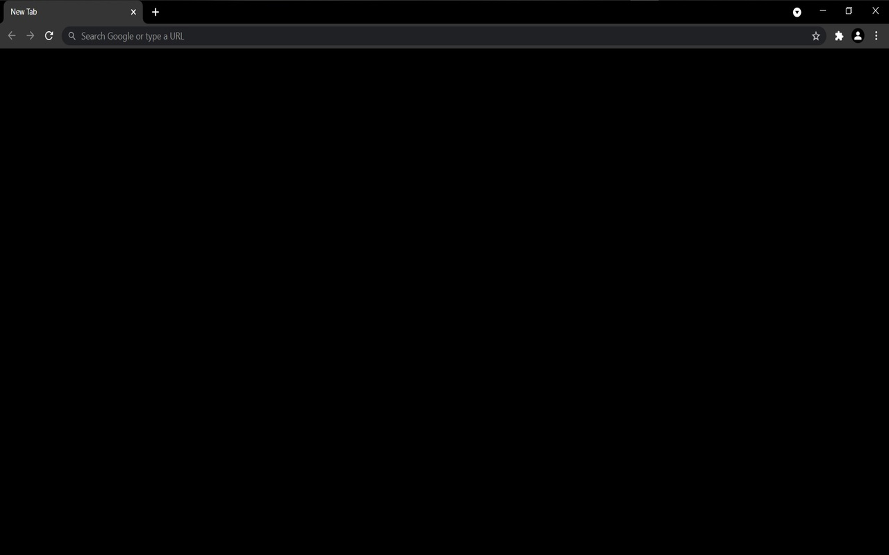

  

# Black New Tab FOCUS

_Focus on what matters._

A Chrome extension that replaces your default new tab page with a distraction-free black screen to help you stay focused and boost productivity.

## Features

- **Distraction-Free Interface:** Enjoy a clean, black new tab without any clutter.
- **Minimalistic Design:** Remove unnecessary elements to create a calming, focused environment.
- **Enhanced Productivity:** Helps you concentrate on your tasks by eliminating visual distractions.

## Installation

Install **Black New Tab FOCUS** directly from the [Chrome Web Store](https://chrome.google.com/webstore/detail/black-new-tab-focus/picgjdlclngdpmmjhonhkkadanphjcig) or [Microsoft Edge Addons](https://microsoftedge.microsoft.com/addons/detail/black-new-tab-focus/kmbfimooonjfjcllnegcdmpjjedljbcm).

## Usage

Once installed, open a new tab in Chrome to see your new, minimalist black page. No setup is required—just open a new tab and start focusing.

## License

This project is licensed under the [MIT License](LICENSE).
